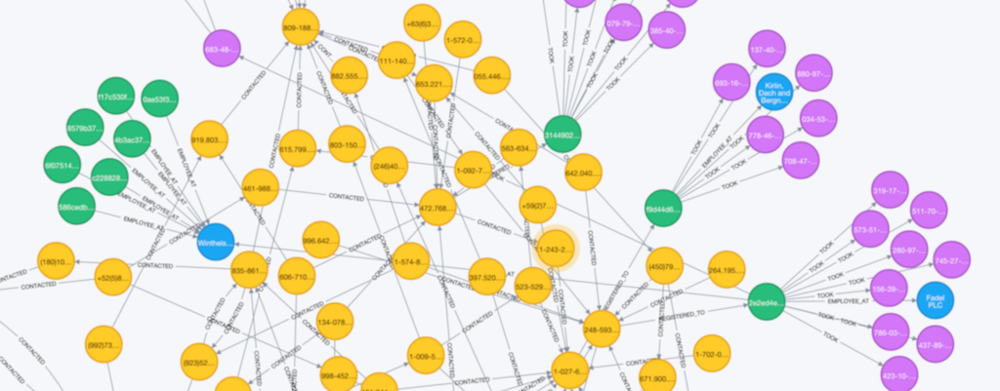

# [Hale](https://www.wikiwand.com/en/Daniel_Hale_Williams)

Exploring relationships in graphs



## Domain

Hale is designed for problems that fit into a specific domain, with the following structure:

```
(agent)-[:SUBJECT_IN]->(event)-[:OVER]->(element)
```

Examples:

  - Authors publishing articles
  - People buying products
  - Users rating films
  - Musicians releasing records

There are 3 main elements in Hale:

  - **Agent**: these are entities that actions stem from. They don't have to represent real world entities, or physical ones. For instance, a person rating a hotel.
  - **Event**: these are triggered when an agent performs actions over elements. From the previous example, the rating of the hotel would be the event.
  - **Element**: these represent an abstract entity the event relates to. In our example, the it would be the hotel being rated

### Data Format

*Agent*:

  - id: string
  - type: string


*Event*:
  - id: string
  - type: string
  - timestamp: long (optional)
  - context: string. (Used to bind several events in the same context; e.g. web browsing session, vacation in which hotels were rated)
  - agentId
  - elementId

*Element*
  - id: string
  - type: string

See example [here](assets/files/event.json)

## Setting things up

  - Download, and install neo4j [TODO]
  - Download the APOC plugin [TODO]
  - Create indexes in neo4j [TODO]
  - Ingest data into your neo4j database [TODO]
  - Run queries [TODO]

## Roadmap

  - Graph algorithms for collaborative filtering
  - Content based similarity in elastic search, using text
